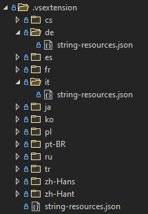

# Commands

Commands trigger actions in Visual Studio. They manifest as buttons parented to menus and/or toolbars in the IDE with their execution tied to user interaction. Commands in the new Extensibility Model run asynchronously and so the user can continue to interact with IDE while commands are executing.

## Creating new commands

To get started, add a reference to the Microsoft.VisualStudio.Extensibility NuGet package.

### Registering a command

Creating a command with the new Extensibility Model is as simple as extending the base class `Microsoft.VisualStudio.Extensibility.Commands.Command` and adorning your class with the attribute `Microsoft.VisualStudio.Extensibility.Commands.CommandAttribute`.

The attribute `Microsoft.VisualStudio.Extensibility.Commands.CommandAttribute` has a few parameters that you should become familiar with:

| Parameter | Type | Descriptions |
| --------- |----- | ------------ |
| Name | String | A globally unique identifier for the command. It is recommended to use the full class name of your command here. |
| Id | ushort | A locally unique identifier for your command within your extension. Each command within your extension should use a different value. |
| DisplayName | String | The default display name of your command. Surround this string with the '%' character to enable localizing this string. See more on this at [Localizing a command](TODO: How do I link to another section of this doc?) |
| ContainerType | Type? | The type that is to act as the CommandSet for this command. Setting this parameter to null automatically generates a default CommandSet for yor command. |
| Placement | KnownCommandPlacement | Indicates where within Visual Studio your command should be parented. |
| ClientContext | String | Client contexts requested by the command, separated by ','. By default only the Shell context is returned. TODO: what are the other options for contexts? Will there be a separate doc about these that I can link to? |

```
    [Command(CommandName, CommandId, "Sample Remote Command", placement: KnownCommandPlacement.ToolsMenu)]
	public class CommandHandler : Command
	{
		private const ushort CommandId = 1;
		private const string CommandName = "SimpleRemoteCommandSample.Command";

		public CommandHandler(VisualStudioExtensibility extensibility, TraceSource traceSource, ushort id)
			: base(extensibility, id)
		{
		}

		public override Task ExecuteCommandAsync(IClientContext context, CancellationToken cancellationToken)
		{
			return Task.CompletedTask;
		}
	}
```

See the [InsertGuidExtension](TODO: add in a link to the InsertGuidSample once its published) sample to get started with creating an extension with a command.

### Adding an icon

Commands support adding icons to their menu item in addition to or instead of display name of the command. To add an icon to your command, you need to add the attribute `Microsoft.VisualStudio.Extensibility.Commands.CommandIconAttribute` to your command class. You can then set the `imageMoniker` parameter to any of the [KnownMonikers](https://docs.microsoft.com/en-us/dotnet/api/microsoft.visualstudio.imaging.knownmonikers?view=visualstudiosdk-2022) currently supported by Visual Studio. Custom monikers are not supported at this time. You can also configure your icon with `Microsoft.VisualStudio.Extensibility.Commands.IconSettings`, which will control how your command is displayed if parented to a toolbar.

```
    [CommandIcon("Extension", IconSettings.IconAndText)]
```

### Controlling command visibility

The visibility of a command can be controlled by adding the attribute `Microsoft.VisualStudio.Extensibility.Commands.CommandVisibleWhenAttribute` to your command class. This attribute supports specifying an expression, defining a set of terms used in the expression, and what values those terms should be replaced with upon evaluation. Note: Term names and values are mapped to their index in the array. i.e. the term name at index 0 corresponds with the term value at that same index. An example of such an expression can be seen here:

```
    [CommandVisibleWhen("AnyFile", new string[] { "AnyFile" }, new string[] { "ClientContext:Shell.ActiveEditorContentType=.+" })]
```

QUESTION: Is there an existing doc somewhere that I can point to for what possible term values are?

If this attribute is omitted from your command, the default is for the command to always be visible.

### Controlling command Enabled/Disabled state

The visibility of a command can be controlled by adding the attribute `Microsoft.VisualStudio.Extensibility.Commands.CommandEnabledWhenAttribute` to your command class. This attribute supports specifying an expression, defining a set of terms used in the expression, and what values those terms should be replaced with upon evaluation. Note: Term names and values are mapped to their index in the array. i.e. the term name at index 0 corresponds with the term value at that same index. An example of such an expression can be seen here:

```
    [CommandEnabledWhen(
		"SolutionLoaded & IsValidFile",
		new string[] { "SolutionLoaded", "IsValidFile" },
		new string[] { "SolutionState:Exists", "ClientContext:Shell.ActiveSelectionFileName=(.jpg|.jpeg|.txt)$" })]
```

QUESTION: Is there an existing doc somewhere that I can point to for what possible term values are?

If this attribute is omitted from your command, the default is for the command to always be enabled. You can also automatically have your command be disabled if it currently executing by setting `this.DisableDuringExecution = true;` in the constructor of your command class.

### Localizing a command

The text displayed on a command can be localized by including `string-resources.json` files with your extension and formatting the DisplayName parameter with the '%' character on either end in your `Microsoft.VisualStudio.Extensibility.Commands.CommandAttribute`.

Localized Command DisplayName
```
    [Command(CommandName, CommandId, "%Microsoft.VisualStudio.MyExtension.SampleRemoteCommand.DisplayName%", placement: KnownCommandPlacement.ToolsMenu)]
```

#### string-resources.json

Your extension should provide a `string-resources.json` file for every language that your extension supports. This JSON file is a dictionary of key/value pairs where the key is a globally (all of Visual Studio) unique identifier for a string resource and the value is the localized string resource. These JSON files should be deployed with your extension under the ".vsextension" directory, with each language you support being shipped in a folder matching the name of the locale i.e. "de" for German, "it" for Italian, etc. The `string-resources.json` deployed at the root of the ".vsextension" directory is used as the default if your extension does not support the language that Visual Studio is currently set to. An example of what this directory structure would look like can be seen here:



string-resources.json sample:
```
    {
        "Microsoft.VisualStudio.MyExtension.SampleRemoteCommand.DisplayName": "Sample Remote Command",
        "Microsoft.VisualStudio.MyExtension.OutputWindowTest.DisplayName": "Output Window Test"
    }
```