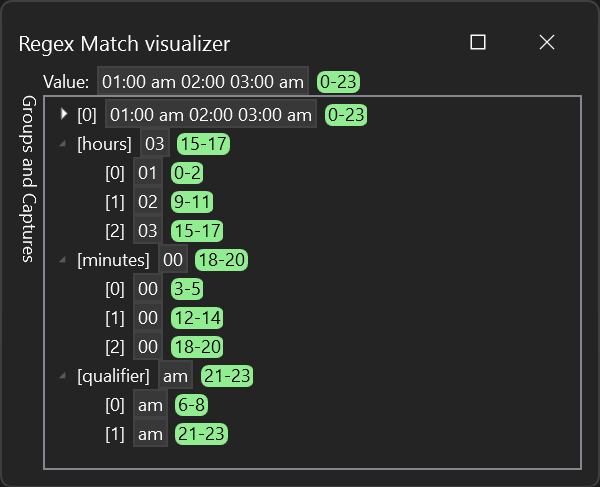

# RegEx Match Debug Visualizer

This VisualStudio.Extensibility extension adds two new debugger visualizers supporting the .NET [`Match`](https://learn.microsoft.com/en-us/dotnet/api/system.text.regularexpressions.match) and [`MatchCollection`](https://learn.microsoft.com/en-us/dotnet/api/system.text.regularexpressions.matchcollection) classes.



The extension is composed of two projects: `RegexMatchDebugVisualizer`, the actual extension, and `RegexMatchObjectSource`, the *visualizer object source* library.

## Creating the extension

The extension project is created as described in the [tutorial document](../../../docs/new-extensibility-model/getting-started/create-your-first-extension.md). You can also reference the [debugger visualizers guide](../../../docs/new-extensibility-model/extension-guides/debuggerVisualizers/debuggerVisualizers.md) for additional information.

## The `Match` visualizer

The next step is to create a `DebuggerVisualizerProvider` class to visualize instances of [`Match`](https://learn.microsoft.com/en-us/dotnet/api/system.text.regularexpressions.match):

```csharp
[VisualStudioContribution]
internal class RegexMatchDebuggerVisualizerProvider : DebuggerVisualizerProvider
{
    ...
```

If the `Match` type was serializable by Newtonsoft.Json, the visualizer implementation would be extremely simple:

```csharp
public override DebuggerVisualizerProviderConfiguration DebuggerVisualizerProviderConfiguration => ew("Regex Match visualizer", typeof(Match));

public override async Task<IRemoteUserControl> CreateVisualizerAsync(VisualizerTarget isualizerTarget, CancellationToken cancellationToken)
{
    var regexMatch = await visualizerTarget.ObjectSource.RequestDataAsync<Match>(jsonSerializer: null, cancellationToken);
    return new RegexMatchVisualizerUserControl(regexMatch);
}
```

Unfortunately `Match` is not serializable as-is, so we need a new serializable class [`RegexMatch`](RegexMatchObjectSource/RegexMatch.cs). And we will need to create a *visualizer object source* library to convert the `Match` into a serializable `RegexMatch`, more about this in [a later paragraph](#the-visualizer-object-source). For now let's just update the `RequestDataAsync` call to use `RegexMatch`:

```csharp
var regexMatch = await visualizerTarget.ObjectSource.RequestDataAsync<RegexMatch>(jsonSerializer: null, cancellationToken);
```

### Adding the remote user control

We now have to create the `RegexMatchVisualizerUserControl` [class](./RegexMatchDebugVisualizer/RegexMatch/RegexMatchVisualizerUserControl.cs) and its associated [XAML file](./RegexMatchDebugVisualizer/RegexMatch/RegexMatchVisualizerUserControl.xaml). This process is described in the [Remote UI documentation](../../../docs/new-extensibility-model/inside-the-sdk/remote-ui.md).

Every time we create a remote user control like `RegexMatchVisualizerUserControl` we need to configure the corresponding XAML file as embedded resource. In this case, since I placed the XAML file in a subfolder, I also need to use `LogicalName` to make sure the name of the resource matches the full name of the remote user control class. This is all done in the `.csproj` file:

```xml
  <ItemGroup>
    <Page Remove="RegexMatchVisualizerUserControl.xaml" />
    <EmbeddedResource Include="RegexMatch\RegexMatchVisualizerUserControl.xaml" LogicalName="$(RootNamespace).RegexMatchVisualizerUserControl.xaml" />
  </ItemGroup>
```

## The visualizer object source

The *visualizer object source* assembly will be loaded by the debugger into the process being debugged and will take care of converting the `Match` object into a serializable `RegexMatch`.

I will start creating a `RegexMatchObjectSource` class library targeting `netstandard2.0` and adding a project reference to [Microsoft.VisualStudio.DebuggerVisualizers](https://www.nuget.org/packages/Microsoft.VisualStudio.DebuggerVisualizers) version 17.6 or newer. Targeting `netstandard2.0` will allow the debugger visualizer to easily work with a large variety of .NET versions.

I will then create a `RegexMatchObjectSource` class extending `VisualizerObjectSource` and will override the `GetData` method to convert the `target` from a `Match` to a `RegexMatch` and use the `VisualizerObjectSource.SerializeAsJson` method to write the value to the `outgoingData` stream.

```csharp
public class RegexMatchObjectSource : VisualizerObjectSource
{
    public override void GetData(object target, Stream outgoingData)
    {
        if (target is Match match)
        {
            RegexMatch result = Convert(match);
            SerializeAsJson(outgoingData, result);
        }
    }

    ...
```

The `GetData` method is invoked by the debugger when the `RegexMatchDebuggerVisualizerProvider` calls `RequestDataAsync`.

`SerializeAsJson` will serialize the `RegexMatch` object using Newtonsoft.Json, which is loaded by the debugger in the process being debugged via reflection. Since my *visualizer object source* doesn't need to refence Newtonsoft.Json directly, I didn't include a `PackageReference` to it, which is preferrable since we should minimize the dependencies of the *visualizer object source* assembly. Because I am not referencing Newtonsoft.Json, the `RegexMatch` class uses `DataContract` and `DataMember` attributes to control serialization instead of the Newtonsoft.Json-specific types.

My [`RegexMatchObjectSource`](./RegexMatchObjectSource/RegexMatchObjectSource.cs) implementation contains a small trick: the [`Group.Name`](https://learn.microsoft.com/en-us/dotnet/api/system.text.regularexpressions.group.name) property is read through reflection since it's available on most .NET versions but it is not included in the `netstandard2.0` APIs:

```csharp
private static readonly Func<Group, string?>? GetGroupName =
    (Func<Group, string?>?)typeof(Group).GetProperty("Name")?.GetGetMethod().CreateDelegate(typeof(Func<Group, string?>));

...

Name = $"[{GetGroupName?.Invoke(g) ?? i.ToString()}]"
```

### Referencing the visualizer object source from the extension

First, we need to make sure that the *visualizer object source* library is packaged as part of the extension. We can do that in the extension's `.csproj` file:

```xml
  <ItemGroup>
    <Content Include="..\..\..\..\bin\samples\RegexMatchObjectSource\$(Configuration)\netstandard2.0\RegexMatchObjectSource.dll" Link="netstandard2.0\RegexMatchObjectSource.dll">
      <CopyToOutputDirectory>PreserveNewest</CopyToOutputDirectory>
    </Content>
  </ItemGroup>

  <ItemGroup>
    <ProjectReference Include="..\RegexMatchObjectSource\RegexMatchObjectSource.csproj" ReferenceOutputAssembly="false" />
  </ItemGroup>
```

The `ProjectReference` guarantees that the *visualizer object source* library is built before the extension and the `Content` item makes sure that the *visualizer object source* DLL is copied into the `netstandard2.0` extension's subfolder where it will be discoverable by the debugger.

I have decided to use `ReferenceOutputAssembly="false"` to avoid a dependency of the extension assembly from the *visualizer object source* one. This allows using conditional compilation (`#if`) to have slightly different definitions of [`RegexCapture`](./RegexMatchObjectSource/RegexCapture.cs) in the two projects. Since I decided to avoid the dependency, I will need to:

1. link the `RegexMatch.cs` file (and the related `RegexCapture` and `RegexGroup` ones) so that they are available in both projects:

```xml
  <ItemGroup>
    <Compile Include="..\RegexMatchObjectSource\RegexGroup.cs" Link="SharedFiles\RegexGroup.cs" />
    <Compile Include="..\RegexMatchObjectSource\RegexCapture.cs" Link="SharedFiles\RegexCapture.cs" />
    <Compile Include="..\RegexMatchObjectSource\RegexMatch.cs" Link="SharedFiles\RegexMatch.cs" />
  </ItemGroup>
```

2. Reference the `RegexMatchObjectSource` from the `DebuggerVisualizerProviderConfiguration` using its assembly-qualified name:

```csharp
    public override DebuggerVisualizerProviderConfiguration DebuggerVisualizerProviderConfiguration => new("Regex Match visualizer", typeof(Match))
    {
        VisualizerObjectSourceType = new("Microsoft.VisualStudio.Gladstone.RegexMatchVisualizer.ObjectSource.RegexMatchObjectSource, RegexMatchObjectSource"),
    };
```

In most cases, having the extension project dependend on the *visualizer object source* library is simpler: I could have simplified the `DebuggerVisualizerProviderConfiguration` to:

```csharp
    public override DebuggerVisualizerProviderConfiguration DebuggerVisualizerProviderConfiguration => new("Regex Match visualizer", typeof(Match))
    {
        VisualizerObjectSourceType = new(typeof(RegexMatchObjectSource)),
    };
```

## The `MatchCollection` visualizer

Now that the `Match` visualizer is complete, we can add a second visualizer for the [`MatchCollection`](https://learn.microsoft.com/en-us/dotnet/api/system.text.regularexpressions.matchcollection) class. The process is exactly the same: I have created [a new `DebuggerVisualizerProvider`](./RegexMatchDebugVisualizer/RegexMatchCollection/RegexMatchCollectionDebuggerVisualizerProvider.cs) and its [remote user control](./RegexMatchDebugVisualizer/RegexMatchCollection/RegexMatchCollectionVisualizerUserControl.cs). I also added [a new `VisualizerObjectSource`](./RegexMatchObjectSource/RegexMatchCollectionObjectSource.cs) to the *visualizer object source* library.

Each call to `RequestDataAsync` is allowed only 5 seconds to complete or will result in a timeout exception. Since the `MatchCollection` could contain many entries, I have implemented the *visualizer object source* using the `TransferData` method instead of `GetData`: `TransferData` accepts a parameter which allows my visualizer to query the collection entries in a paginated fashion:

```csharp
private const int MaxPageSize = 10;

public override void TransferData(object target, Stream incomingData, Stream outgoingData)
{
    var index = (int)DeserializeFromJson(incomingData, typeof(int))!;

    RegexMatch[]? results = null;
    if (target is MatchCollection matchCollection)
    {
        int pageSize = Math.Max(0, Math.Min(MaxPageSize, matchCollection.Count - index));
        results = new RegexMatch[pageSize];
        for (int i = 0; i < results.Length; i++)
        {
            var result = RegexMatchObjectSource.Convert(matchCollection[index + i]);
            result.Name = $"[{index + i}]";
            results[i] = result;
        }
    }

    SerializeAsJson(outgoingData, results);
}
```

Instead of using the `VisualizerTarget` directly, the `DebuggerVisualizerProvider` passes it to the remote user control so that it can asynchronously request the collection entries without delaying the display of the visualizer UI to the user.

```csharp
public override Task<IRemoteUserControl> CreateVisualizerAsync(VisualizerTarget visualizerTarget, CancellationToken cancellationToken)
{
    return Task.FromResult<IRemoteUserControl>(new RegexMatchCollectionVisualizerUserControl(visualizerTarget));
}
```

The remote user control uses the `RequestDataAsync` override that takes a `message` parameter, which results in `TransferData` being invoked on the *visualizer object source*. The remote user control will loop, invoking `RequestDataAsync` for increasing index numbers until the *visualizer object source* returns an empty array, indicating the end of the collection:

```csharp
public override Task ControlLoadedAsync(CancellationToken cancellationToken)
{
    _ = Task.Run(async () =>
    {
        int i = 0;
        while (true)
        {
            RegexMatch[]? regexMatches = await this.visualizerTarget.ObjectSource.RequestDataAsync<int, RegexMatch[]?>(message: i, jsonSerializer: null, CancellationToken.None);
            if (regexMatches?.Length > 0)
            {
                foreach (var regexMatch in regexMatches)
                {
                    this.RegexMatches.Add(regexMatch);
                }

                i += regexMatches.Length;
            }
            else
            {
                break;
            }
        }
    });

    return Task.CompletedTask;
}
```

This is a very simple implementation of a debugger visualizer which relies on `RequestDataAsync`. More complex implementations may pass more complex parameters to `RequestDataAsync` in order to retrieve different information from the *visualizer object source*. You could even invoke `RequestDataAsync` in response to the user's interactions with the remote user control, allowing the user to "explore" the content of, potentially very large, objects.
