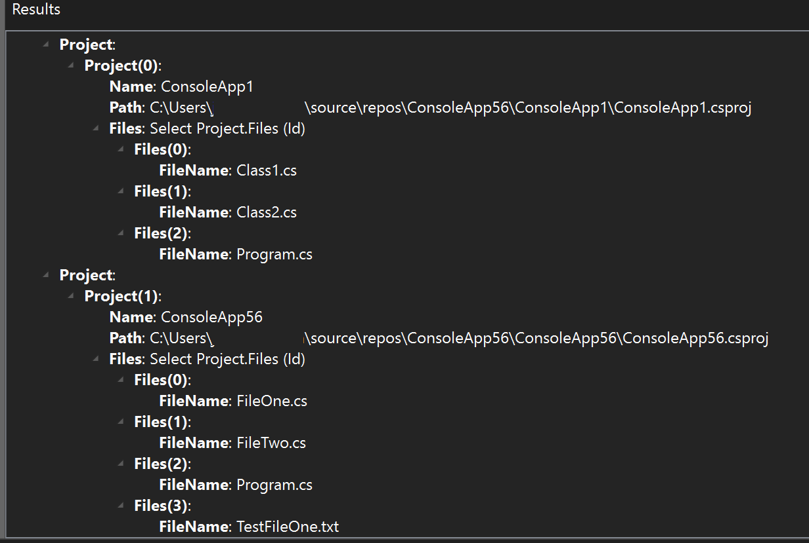
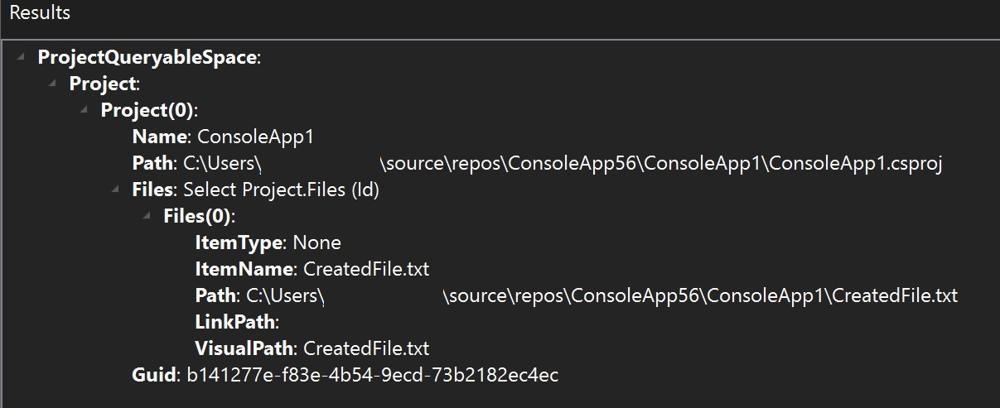

# Walkthrough: VS Project Query API Extension

This extension demonstrates the most basic usage of the VS Project Query API. For further assistance in creating queries use [VS Project Query API Browser](<https://marketplace.visualstudio.com/items?itemName=vsext.VSProjectQueryAPIBrowser&ssr=false#overview>) found in Visual Studio Extension Marketplace.

## Overview

The Project System Query API allows users to retrieve and update information in the Project System such as source files, build configurations, dependencies and much more.

## Setting Up IProjectModelQueryableSpace

The code snippet below as seen below sets up the Project Query Service:

```csharp
IProjectModelQueryableSpace querySpace = new ProjectQueryableSpace(this.serviceBroker);
```

The `queryableSpace` requires a service broker to gain access to information in the Project System.

## Accessing API Metadata

Once the user establishes a `queryableSpace`, users may query information about the Project System on the Solution and/or Project level. Using the keyword `With` the query can collect the value of a property/collection.

In our example, we call the `ExecuteQueryAsync` method to get information from the projects, namely the Project Name, Project Path, Project Files, and File Names.

```csharp
var result = await queryableSpace.Projects
         .With(project => project.Name)
         .With(project => project.Path)
         .With(project => project.Files
            .With(file => file.FileName))
.ExecuteQueryAsync(cancellationToken);
```
The image below showcases the information that the result holds.


*Figure 1: Execute Query Async Result*

## Modifying the Project System

Using the same `queryableSpace`, users may modify data in their project system. `Where` is used to identify the value of a property/collection to be returned from the query and `AsUpdatable` is to update the object from the query result. These actions modifying the Project System may include creating/deleting files, building/cleaning/deploying solutions, setting properties, and more.

In our example, we call the `ExecuteAsync` method to create a new file. The file we want to add is called `CreatedFile.txt`, and we want to add it to our project called `ConsoleApp1`.


```csharp
var result = await queryableSpace.Projects
         .Where(project => project.Name == "ConsoleApp1")
         .AsUpdatable()
         .CreateFile("CreatedFile.txt")
.ExecuteAsync(cancellationToken);
```
The image below details the new information created for the newly created file.


*Figure 2: Execute Async Result*
