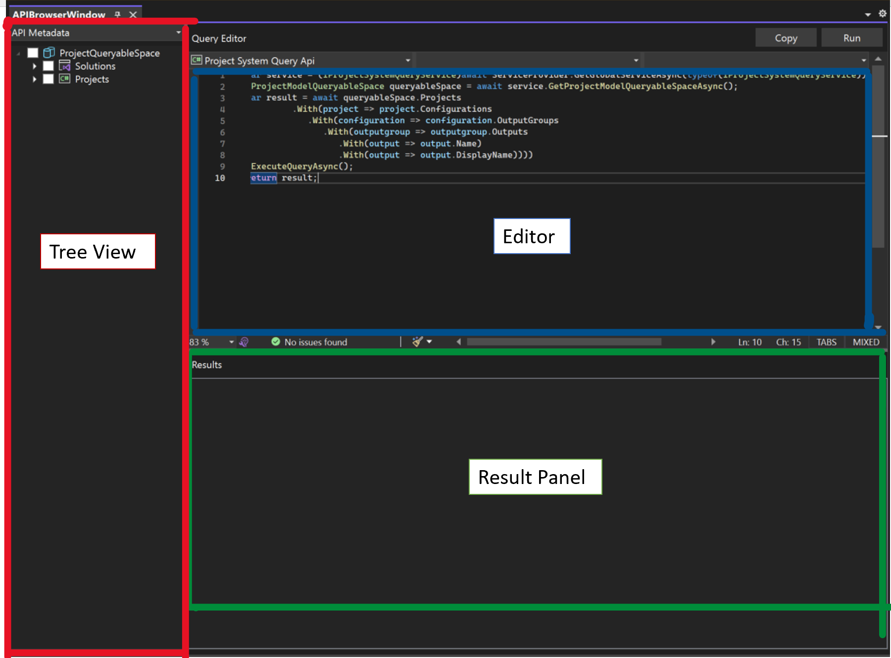
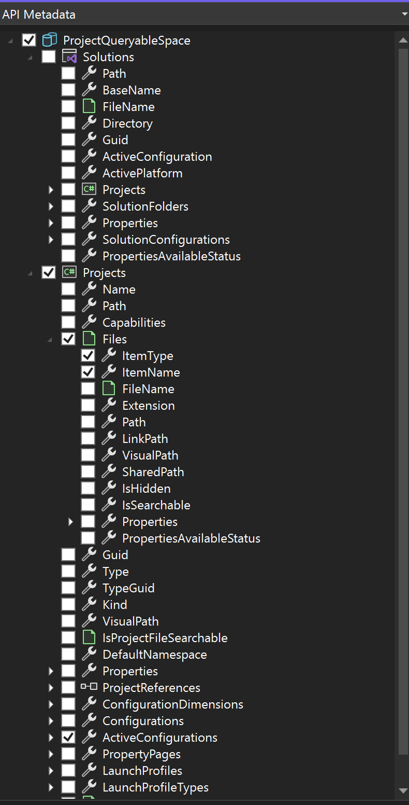
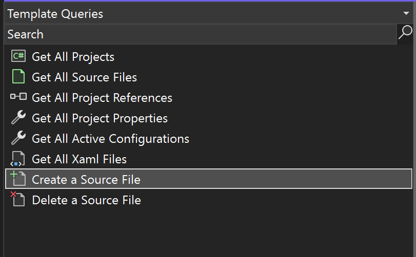
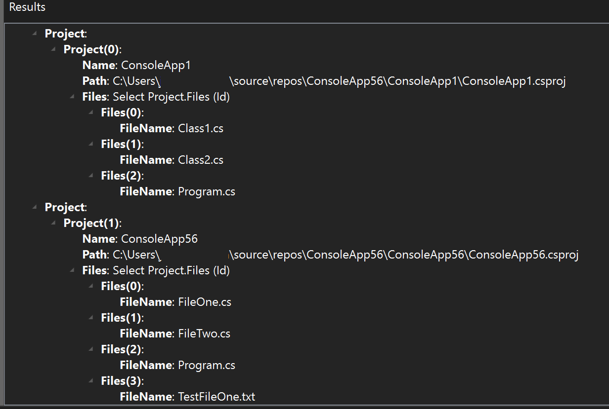

# Walkthrough: VS Project Query API Browser Extension

This is a walkthrough on how to use [VS Project Query API Browser](<https://marketplace.visualstudio.com/items?itemName=vsext.VSProjectQueryAPIBrowser&ssr=false#overview>) found in Visual Studio Extension Marketplace.

## Overview

The Project System Query API allows users to retrieve and update information in the Project System such as files, build configurations, dependencies and much more. However, as more functionality is added to the API, it is hard for consumers and developers to verify the information and functionality that is available. With this extension writing, testing and verifying Project System queries is much more accessible.

## Getting Started

The browser is composed of three main components: the editor, results panel, and tree view panel.


*Figure 1: Project Query API Browser Components*

The embedded editor has IntelliSense and colorization. Users may type directly into the editor to write their Project Queries.

Above the editor, there are two buttons: Copy and Run. Users may run their query to verify if their query functions. If the query is supported, the results are then outputted to the results panel below the editor. Otherwise, a  notification pop-up will notify the user the query is unsupported. Users may also copy their query to the clipboard.

To get started, load a solution into Visual Studio. Once loaded, you may perform queries regarding the solution you have loaded.

## Writing Queries

To access the Project Query API, users must establish a `queryableSpace` through a broker service.

```csharp
var service = (IProjectSystemQueryService)await ServiceProvider.GetGlobalServiceAsync(typeof(IProjectSystemQueryService));
IProjectModelQueryableSpace queryableSpace = await service.GetProjectModelQueryableSpaceAsync();
```

Once the user establishes a `queryableSpace`, users may type information that would like to know about the Project System on the Solution and/or Project level. Using the keyword `With` the query can collect the value of a property/collection.

```csharp
var result = await queryableSpace.Projects
         .With(project => project.Name)
         .With(project => project.Path)
         .With(project => project.Files
            .With(file => file.ItemType)
            .With(file => file.ItemName)
            .With(file => file.Path)
            .With(file => file.LinkPath)
            .With(file => file.VisualPath))
         .With(project => project.Guid)
.ExecuteQueryAsync();
```

In our example, we call the `ExecuteQueryAsync` method to get information from the projects, namely the Project Name, Project Path, Project Files, File Names, File Paths, and Project Guid.


*Figure 2: Execute Query Async Result*

## API Metadata Treeview

Instead of writing queries, users may use the API Metadata tree located on the left panel of the Project Query API Browser. Users may select/deselect the information that they would like to receive from the query. As users select and deselect items in the tree view, the editor will dynamically change its query.


*Figure 3: Tree View of API Metadata*

## Template Queries

On the left panel, there is a dropdown menu where users may select `Template Queries`. Template Queries are prebuilt queries to help get started.


*Figure 4: List of Template Queries*

Below is a template query to `Create a File`.

```csharp
var result = await queryableSpace.Projects
    .Where(project => project.Name == "ConsoleApp1")
.AsUpdatable()
.CreateFile("FileName")
.ExecuteAsync();
```


*Figure 5: Execute Async Result*
