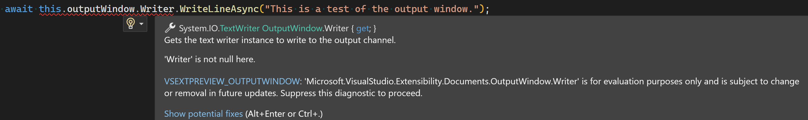

# Experimental APIs

While we work hard to ensure stability and minimize breaking changes, VisualStudio.Extensibility is a growing library, with additional features and updates coming with every new version. When a breaking change to a mature part of the library must be made, we list it on our [Breaking Changes page](breaking_changes.md). However, for parts of the API that are likely to be modified in the future, we may add the `[Experimental]` attribute to any associated types and members to indicate to extension authors that they can expect changes in subsequent versions.

Here are some examples of the situations in which we would use the `[Experimental]` attribute:
* We've added a new feature area, and we want to monitor for issues and user feedback.
* We're working on a large feature area, but we want to make a finished portion available before the rest of the area is completed.
* We've received user feedback on some of our existing APIs, and we're planning on making future changes to respond to that feedback.

## Using experimental APIs

Using an experimental API in your extension will result in a build error, which is designed to prevent developers from unintentionally using code that is likely to change in future versions.

### Build errors
The error begins with `VSEXTPREVIEW_` and includes the specific experimental feature being used. For example, if you use the experimental output window feature, you will see `VSEXTPREVIEW_OUTPUTWINDOW`:



### Disable experimental API build errors

You can disable the build errors either in your source code for the files where you use the experimental APIs or in the project file for your extension.

#### In source code

Place the following `#pragma` statement in your source code where you use the experimental APIs:

```csharp
#pragma warning disable VSEXTPREVIEW_OUTPUTWINDOW // Type is for evaluation purposes only and is subject to change or removal in future updates.
```

#### In project file

To disable the build error for all uses of each experimental API across all files in your project, you can add a `<NoWarn>` element to your `.csproj` file. For example, to disable the build error for all uses of the output window experimental API in your project, add this statement to your project file:

```xml
<NoWarn>$(NoWarn);VSEXTPREVIEW_OUTPUTWINDOW</NoWarn>
```

## Current experimental APIs

You can find a class that contains each of our current experimental APIs called [`ExperimentalFeatures`](https://learn.microsoft.com/dotnet/api/microsoft.visualstudio.extensibility.experimentalfeatures) in our [API Reference](https://learn.microsoft.com/dotnet/api/microsoft.visualstudio.extensibility).

As of our 17.9 release, there are three experimental features:

| Feature | Label | Description |
|---------|-------|-------------|
| LSP | VSEXTPREVIEW_LSP | LSP support was added with our 17.9 release and we want user feedback to make sure we've got the features needed by extension authors.|
| Output Window | VSEXTPREVIEW_OUTPUTWINDOW | We'updated our output window APIs with our 17.12 release and would like user feedback to see if this could be the final shape. |
| Project Query Tracking | VSEXTPREVIEW_PROJECTQUERY_TRACKING | We're continuing to update our project query API to add new features|
| Project Query Properties and Build Properties | VSEXTPREVIEW_PROJECTQUERY_PROPERTIES_BUILDPROPERTIES | We're continuing to update our project query API to address user feedback and add new features |
| Code lens | VSEXTPREVIEW_CODELENS | Code lens support was added in our 17.12 release and we want user feedback to make sure we've got the features needed by extension authors. |
