# Building and Publishing a Multi-Targeted VSIX

This guide walks through updating a Visual Studio extension (VSIX) to single payload to
multiple payload, that targets both Visual Studio 2022 (17.x) and Visual Studio 2026 (18.x),
publishing it to the marketplace.

---

## Prerequisites

- Visual Studio 2026 18.5 or later for building a multi-targeted extension.
- Visual Studio 2026 18.8 Insiders or later for testing the new Marketplace features.
- Access to the pre-production environment (PPE) internal marketplace at <https://marketplace.vsallin.net/>.

---

## Background (optional steps)

This walkthrough assumes owning an existing extension that targets Visual Studio 2022 (17.0).
The following paragraphs set that up.

### Step 1 — Create a new VSIX project with the traditional tooling

1. In Visual Studio, choose **File → New → Project**.
2. Search for **VSIX** in the template search box.
3. Select **VSIX Project** (C#) and click **Next**.
4. Give the project a name (this guide uses **`Foo`**) and create it.

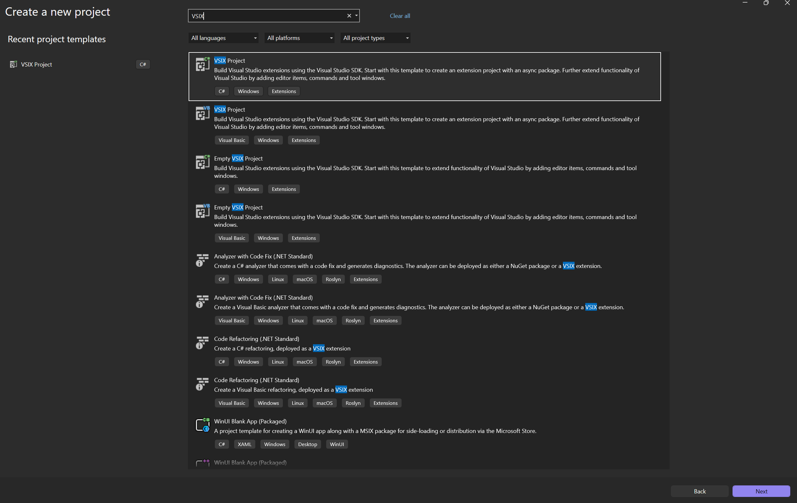

> **NOTE**
> The **VSIX Project** template scaffolds an extension with an async package. The **Empty VSIX
Project** template is also fine if you prefer to add the command files yourself.

---

### Step 2 — Add the command files to the project

Use the command template to add a command to your extension.

1. Right-click your project and choose **Add → New Item**.
2. Under the **Extensibility** templates click **Command**.
3. Give the command a name and click **Next**.

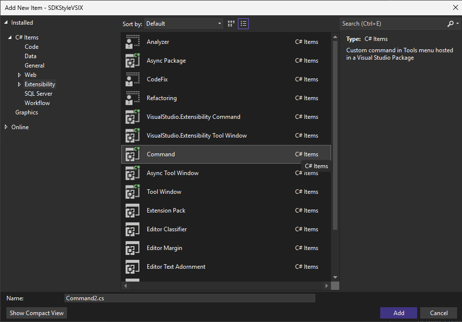

---

### Step 3 — Set the installation targets and the package references

Visual Studio 2026 creates extensions that target VS 17.14+ by default.
If you want to target an earlier version of Visual Studio 2022, update
the installation targets in `source.extension.vsixmanifest` to `[17.0,)` and
update the package references in the .csproj file.

This will be relevant at the end of this walkthrough, when we browse the
VS Marketplace from Visual Studio 17.12.

---

### Step 4 — Build and upload the VSIX to the marketplace (version 1.0)

1. Build the project to produce `Foo.vsix`.
2. Go to <https://marketplace.vsallin.net/> and publish the VSIX under your publisher account.

> **NOTE**:
> The URI https://marketplace.vsallin.net/ is the marketplace pre-production environment (PPE).

After uploading, the **Manage** page shows **Version 1.0** with a single payload targeting **API
Version
17.0**, **amd64**, **Community**:

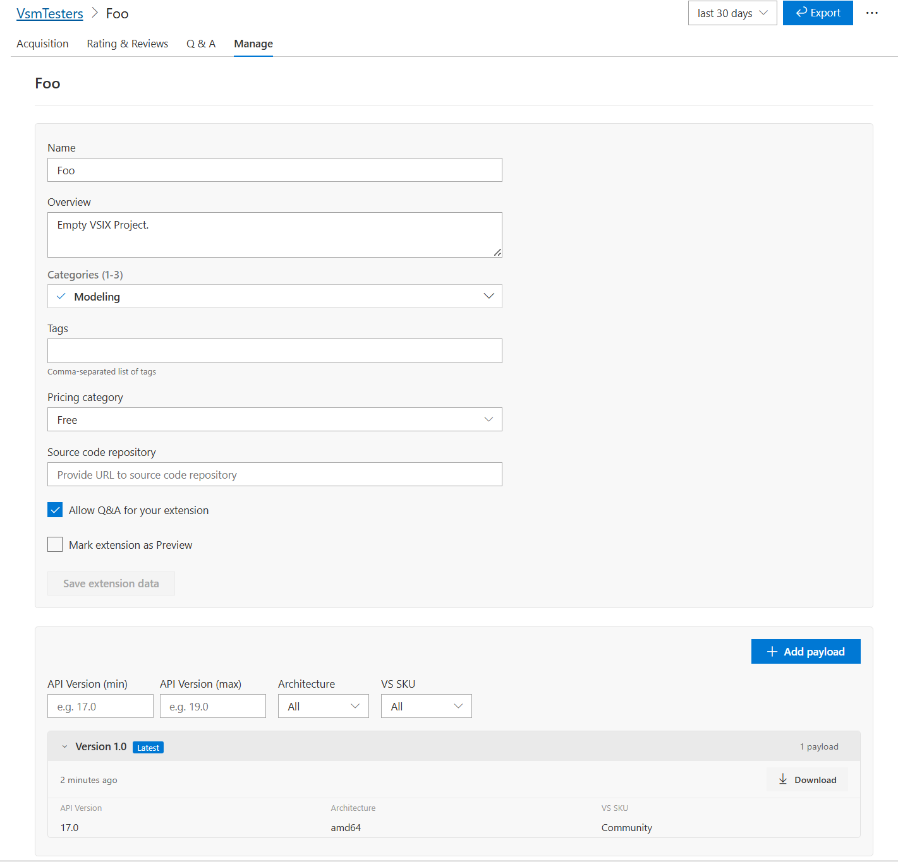

---

## Walkthrough

The following steps update the extension to support multiple payloads targeting VS 17.14+ and 18.5+
and make them both available on the VS Marketplace from the same Marketplace entry.

### Step 1 — Access the NuGet feed with the preview packages

Some of the packages used in the following steps are not yet available on nuget.org and require
adding a custom package source to restore. You can configure this feed in a `nuget.config` file:

```xml
<?xml version="1.0" encoding="utf-8"?>
<configuration>
  <packageSources>
    <add key="vssdk" value="https://pkgs.dev.azure.com/azure-public/vside/_packaging/vssdk/nuget/v3/index.json" />
  </packageSources>
</configuration>
```

### Step 2 — Update the csproj and installation targets

> **NOTE:**
> Starting with version 18.5 of Visual Studio, VSIX projects support SDK-style .csproj files.
Please see: https://devblogs.microsoft.com/visualstudio/sdk-style-support-for-extension-projects/
> for additional information.

To support multiple Visual Studio versions form a single project, switch to the
multi-targeting `Microsoft.VisualStudio.Sdk.Build` SDK.

#### Updated `.csproj` (multi-targeting SDK)

```xml
<Project Sdk="Microsoft.VisualStudio.Sdk.Build">
  <PropertyGroup>
    <TargetFrameworks>vs2022;vs2026_5</TargetFrameworks>
    <ExtensionType>VSSDK</ExtensionType>
    <Nullable>enable</Nullable>
    <LangVersion>latest</LangVersion>
  </PropertyGroup>
</Project>
```

That's all you need! The new format is much simpler and more compact.

`TargetFrameworks` now lists `vs2022` and `vs2026_5`, so a separate payload is produced for each
build target.

#### Updated `source.extension.vsixmanifest`

Bump the version to **2.0** and let the target version be computed per build with `GetInstallationTargetVersion`:

```xml
<?xml version="1.0" encoding="utf-8"?>
<PackageManifest Version="2.0.0" xmlns="http://schemas.microsoft.com/developer/vsx-schema/2011" xmlns:d="http://schemas.microsoft.com/developer/vsx-schema-design/2011">
  <Metadata>
    <Identity Id="Foo.ff3c0a49-d688-40ff-bac6-fd24de1aa3ed" Version="2.0" Language="en-US" Publisher="VsmTesters" />
    <DisplayName>Foo</DisplayName>
    <Description>Empty VSIX Project.</Description>
  </Metadata>
  <Installation>
    <InstallationTarget Id="Microsoft.VisualStudio.Community" Version="|%CurrentProject%;GetInstallationTargetVersion|" />
  </Installation>
  <Dependencies>
    <Dependency Id="Microsoft.Framework.NDP" DisplayName="Microsoft .NET Framework" Version="[4.5,)" d:Source="Manual" />
  </Dependencies>
  <Prerequisites>
    <Prerequisite Id="Microsoft.VisualStudio.Component.CoreEditor" DisplayName="Visual Studio core editor" Version="[17.0, )" />
  </Prerequisites>
  <Assets>
    <Asset Type="Microsoft.VisualStudio.VsPackage" Path="|%CurrentProject%;PkgdefProjectOutputGroup|" d:Source="Project" d:ProjectName="%CurrentProject%" />
  </Assets>
</PackageManifest>
```

#### Multi-targeting SDK template

To create new extensions using the `Microsoft.VisualStudio.Sdk.Build` SDK, enable support for the SDK
template in your VS settings and create a new extension. The feature can be enabled under **Preview
Features**.

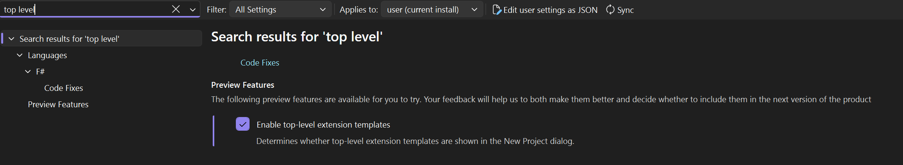

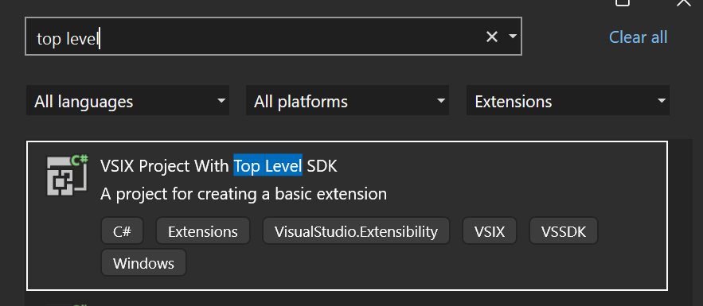

---

### Step 2 - Conditional compilation

Update the command execution by adding conditional compilation wth `VS_185_OR_GREATER` to change your
extension behavior based on the Visual Studio client version.

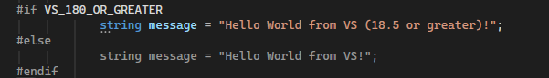

### Step 3 — Build and publish the two VSIXs (version 2.0)

Building the multi-targeted project now produces **two** VSIX payloads — one for each target framework.
Upload each one to the same **Foo** extension as separate payloads.

#### Uploading the payloads

Use **Add payload**, then drop or browse to the built `.vsix` (for example `Foo_18.5_v2.vsix`):

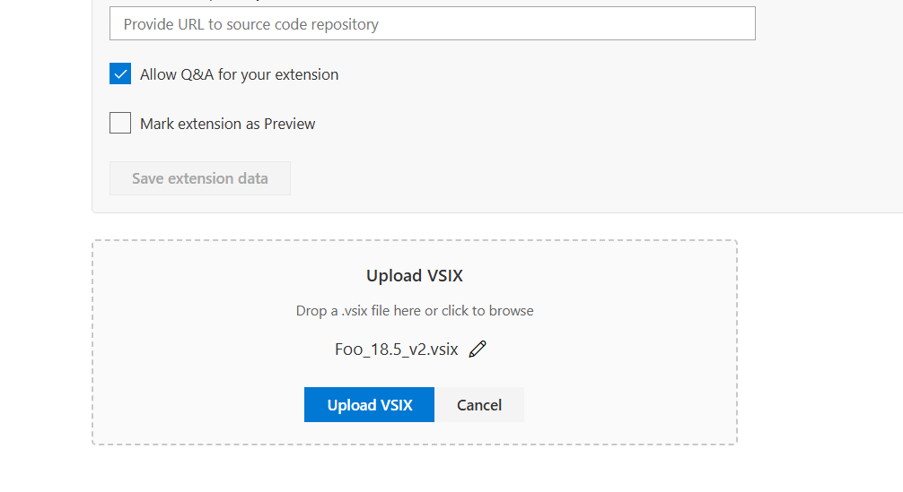

The marketplace extracts relevant metadata from the VSIX.

The VS 2026 payload targets API version **18.5** for both **amd64** and **arm64**:

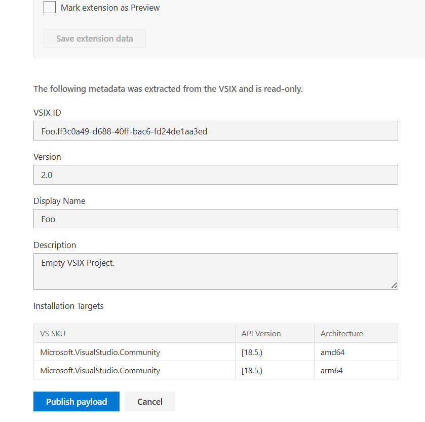

The VS 2022 payload targets API version **17.14** for both **amd64** and **arm64**:

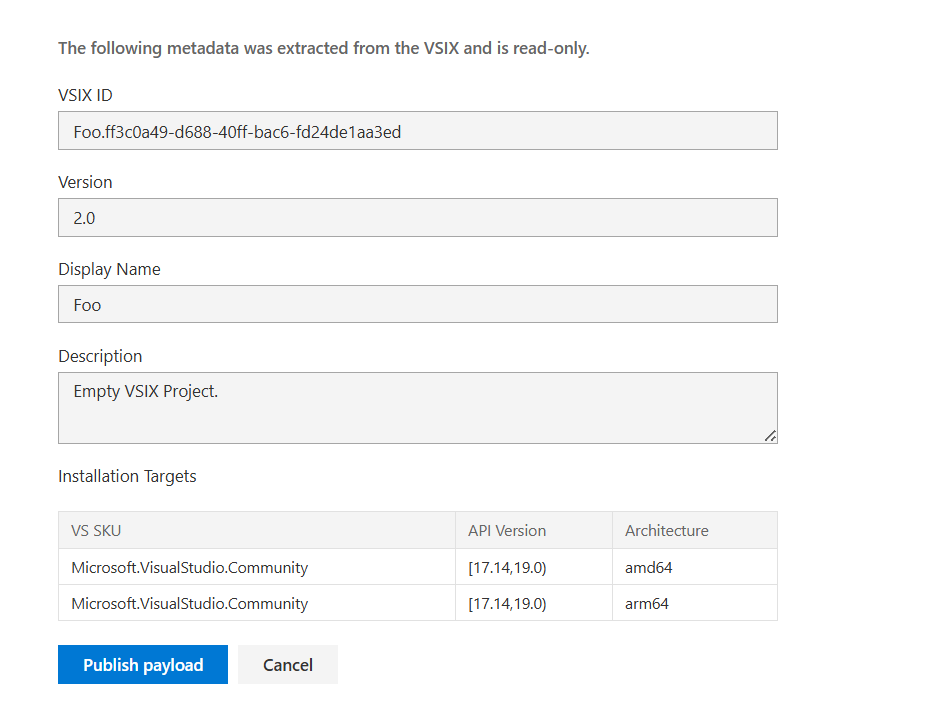

After publishing both payloads, the extension now has Version 2.0 with multiple payloads covering
17.14+ and 18.5+ across amd64 and arm64.

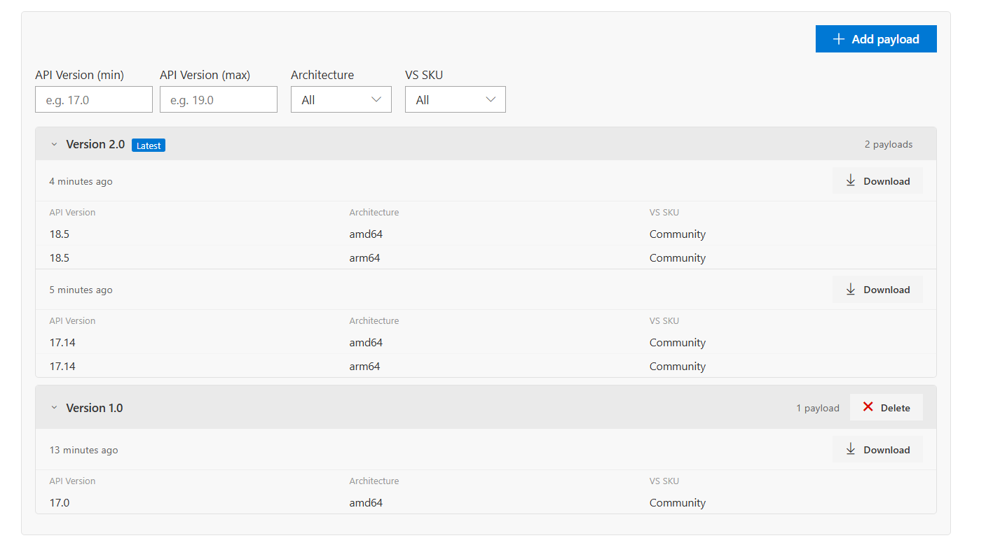

> **NOTE**: When publishing multiple payloads for the same extension version, the VSIX projects
> must be built using Microsoft.VSSDK.BuildTools version 18.6.38345 or later to ensure that the
> correct metadata is included in the VSIX. Not doing so may result in the VS installation to be
> corrupted when installing the extension. This will be enforced, starting next month, by the
> VS Marketplace upon publishing a second payload of an existing extension version.

---

### Step 4 — Enable multiple payloads on Visual Studio 18 (one-time test setup)

Visual Studio 2026 18.8 Insiders needs a feature flag to consume the multi-payload (MPPE) marketplace endpoint.

1. Find the **instance ID** of your VS 18 installation by listing:

   ```text
   %localappdata%\Microsoft\VisualStudio\18.*
   ```

   You'll see a folder like `18.0_a1b2c3d4` — the part after `18.0_` (here `a1b2c3d4`) is the instance ID.

2. Set the following registry key (replace `{ID}` with the instance ID from above) to enable the MPPE
   endpoint:

   ```text
   HKCU\Software\Microsoft\VisualStudio\18.0_{ID}\FeatureFlags\ExtensionManager\UseMppeEndpoint
   ```

   Set it to a `DWORD` value of `1`.

   PowerShell example:

   ```powershell
   $id = (Get-ChildItem "$env:LOCALAPPDATA\Microsoft\VisualStudio\18.*" -Directory |
          Select-Object -First 1).Name.Split('_')[-1]
   $key = "HKCU:\Software\Microsoft\VisualStudio\18.0_$id\FeatureFlags\ExtensionManager"
   New-Item -Path $key -Force | Out-Null
   New-ItemProperty -Path $key -Name "UseMppeEndpoint" -Value 1 -PropertyType DWord -Force
   ```

3. Restart Visual Studio 2026 for the flag to take effect.

---

### Step 5 — Point Visual Studio at the PPE marketplace

The feature flag tells VS to use the MPPE endpoint, but VS still needs to know **which** marketplace to
talk to. Point it at the PPE environment by setting an environment variable:

1. Open **Edit the system environment variables → Environment Variables → New** (a system or user
   variable both work).
2. Add a variable named **`UseTestMarketplaceUri`** with the value **`https://marketplace.vsallin.net`**.

   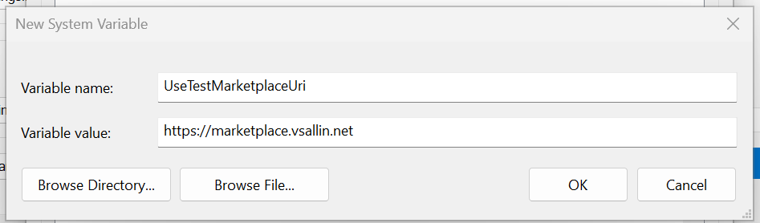

   PowerShell example (user-scoped):

   ```powershell
   [Environment]::SetEnvironmentVariable("UseTestMarketplaceUri", "https://marketplace.vsallin.net", "User")
   ```

3. Restart Visual Studio so it picks up the new environment variable.

---

### Step 6 — Verify version-specific results across VS versions

Search for the **Foo** extension in **Extensions → Manage Extensions** on different Visual Studio
versions. Because the marketplace serves the payload whose installation target matches the running IDE,
each version resolves to a different payload:

| Visual Studio version | Resolved payload    | API Version target |
| --------------------- | ------------------- | ------------------ |
| VS 17.14              | version 2.0 (17.14) | `[17.14, 19.0)`    |
| VS 18.8               | version 2.0 (18.5)  | `[18.5, )`         |
| VS 17.12              | version 1.0 (17.0)  | `[17.0, )`         |

- **VS 17.14** picks up the newer 17.14 payload (Foo **2.0**).

  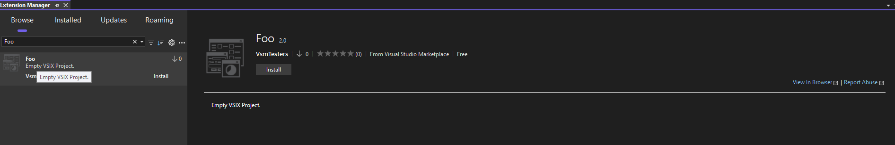

- **VS 18.8** (with the feature flag from Step 9) picks up the 18.5 payload (Foo **2.0**).

  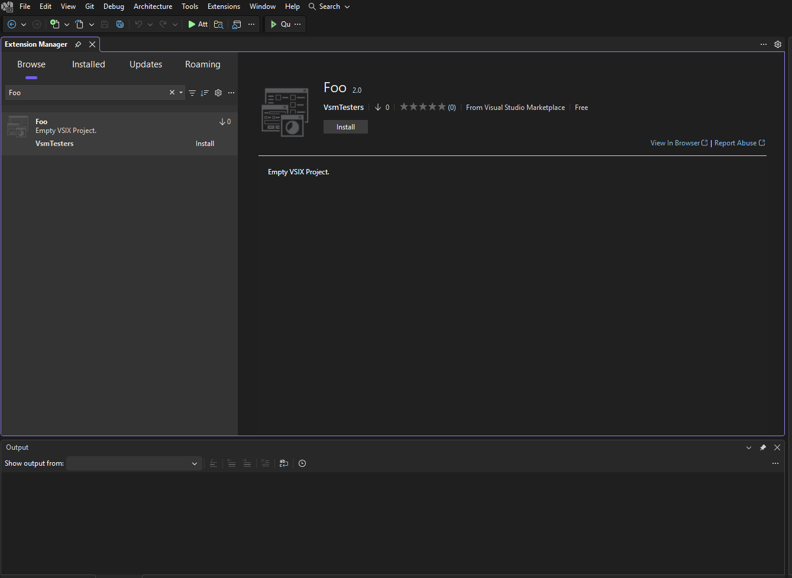

- **VS 17.12** falls back to the original version 1.0 payload (Foo **1.0**), since it's below the 17.14 floor of
  the version 2.0 payload.

  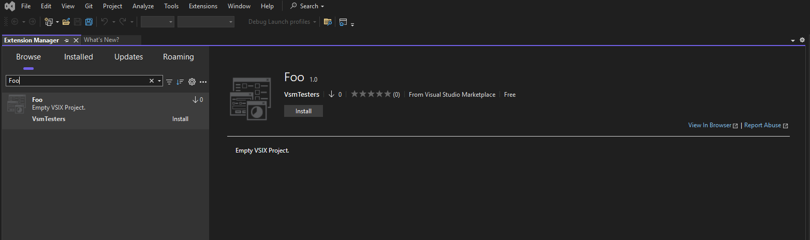

---

## A comment on best practices for payload versioning

Always have the **latest version** of your extension support the **latest Visual Studio version** (API
version), and optionally support any number of older Visual Studio versions through additional
payloads. Following this practice ensures that VS 18.8+ (with the feature flag enabled) and earlier
versions of Visual Studio resolve payloads in the same coherent way.

If you don't follow this practice, payload selection diverges between Visual Studio generations:

- **VS 18.8+** (with the feature flag enabled) selects the payload that supports the **highest** VS
  version, favoring the highest extension version to break ties.
- **Earlier VS versions** select the payload with the **highest version number that still supports
  that VS version**.

Keeping your newest extension version aligned with the newest VS version avoids this divergence and
gives every client a predictable result.