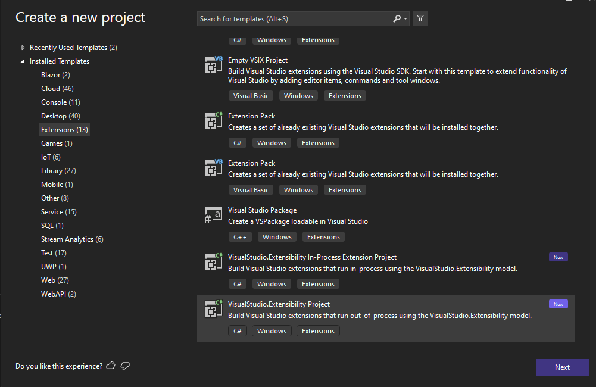

# Creating your first out-of-process Visual Studio extension

## Introduction
This document is a quick walkthrough on how to create your first extension using the new out-of-process extensibility model.

## Prerequisites

* Visual Studio 2022.5 Preview 1 or higher with `.NET desktop development` workload. The latest minimum requirement will always be listed at [Announcements](../../announcements.md) page.

* Install latest version of [VisualStudio.Extensibility Project System](https://marketplace.visualstudio.com/items?itemName=vsext.gladstone): This extension will allow you to debug extension projects using F5. There is currently no other deployment mechanism supported.

* If you are updating from earlier builds, please make sure to update VisualStudio.Extensibility Project System to latest version as there are breaking changes in VisualStudio.Extensibility packages.

## Create the extension project

* Use `VisualStudio.Extensibility Project` template to create a new extensibility project.



At this point you are ready to start extending Visual Studio by adding commands and editor components to your extension.

## Add your first command

The template creates `Command1.cs` as your first command handler which you can use as a starting point. The default attributes shown below will place the command in `Tools` menu with an extension icon. 

```csharp
[CommandIcon(KnownMonikers.Extension, IconSettings.IconAndText)]
[Command("Extension1.Command1", "Sample Remote Command", placement: CommandPlacement.ToolsMenu)]
```

When the command is executed, Visual Studio will call in to `ExecuteCommandAsync` method where you can place a breakpoint. You can utilize `context` argument or `this.Extensibility` object to interact with Visual Studio. 

For example, an example command handler could be as below:

```csharp
public override async Task ExecuteCommandAsync(IClientContext context, CancellationToken cancellationToken)
{
	await context.ShowPromptAsync(
		"Hello from another process!", 
		PromptOptions.OK, 
		cancellationToken);
}
```

For more information on how to add commands, please refer to [Commands](../extension-guides/command/command.md) section.

## Debug your extension

* Making sure that your extension project is selected as startup project in Visual Studio, press `F5` to start debugging.
* This will build your extension and deploy it to the experimental instance of Visual Studio version you are using. The debugger should attach once your extension is loaded.
* You can find the command in `Tools` menu as shown.


## Next steps

If you missed the introductory overviews, see [Welcome to the VisualStudio.Extensibility documentation](../index.md) and [Out-of-Process Extensibility Model Overview](oop-extensibility-model-overview.md).

Now create a slightly more interesting extension; see [Create a simple extension](tutorial-create-simple-extension.md).
